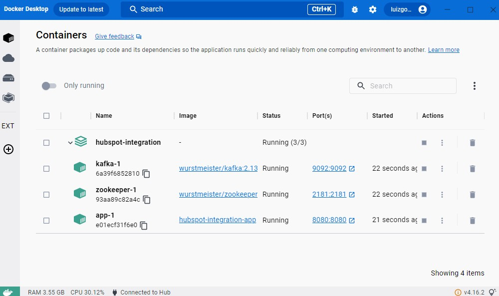
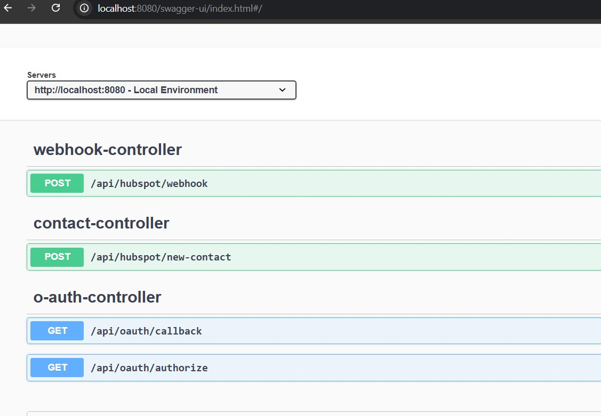

# Documentação Técnica: Integração com a API do HubSpot

## Visão Geral

Este projeto consiste na criação de uma API REST em Java, utilizando o framework Spring Boot, para integração com a API do HubSpot. A API implementa autenticação via OAuth 2.0 (authorization code flow), com endpoints para criação de contatos, processamento de webhooks e gerenciamento de autenticação.

## Objetivos

- **Geração da Authorization URL**: Gera a URL de autorização para iniciar o fluxo OAuth com o HubSpot.
- **Processamento do Callback OAuth**: Recebe o código de autorização fornecido pelo HubSpot e realiza a troca pelo token de acesso.
- **Criação de Contatos**: Cria um contato no HubSpot CRM.
- **Recebimento de Webhook para Criação de Contatos**: Processa eventos do tipo "contact.creation" enviados pelo HubSpot.

## Tecnologias e Ferramentas

- **Java 17**: Linguagem de programação utilizada.
- **Spring Boot 3.4.4**: Framework para criação de aplicações Java.
- **Spring WebFlux**: Framework para chamadas HTTP assíncronas.
- **OAuth 2.0**: Autenticação segura via fluxo de authorization code.
- **Kafka**: Comunicação assíncrona entre os serviços.
- **Lombok**: Redução de boilerplate no código.
- **MapStruct**: Mapeamento de objetos.
- **H2 Database**: Banco de dados em memória para testes.
- **GitHub**: Controle de versão.
- **Docker & Kubernetes**: Containerização e orquestração da aplicação.
- **OpenAPI**: Documentação da API.
- **Swagger**: Interface interativa para testar a API.

## Arquitetura do Sistema

A arquitetura adotada é baseada em **Event-Driven Architecture (EDA)**, com componentes desacoplados que se comunicam via eventos. A **Arquitetura Hexagonal (Ports and Adapters)** garante a separação de responsabilidades, isolando a lógica de negócio das implementações externas, como APIs e bancos de dados.

## Diagramas e Fluxo

### Fluxo de Autenticação

1. O usuário acessa a URL gerada pelo endpoint de autorização.
2. O HubSpot solicita a autorização do usuário.
3. O HubSpot redireciona para o endpoint de callback, que troca o código de autorização por um token de acesso.

### Fluxo de Criação de Contato

1. O token de acesso é utilizado para autenticar a criação de contatos no HubSpot via API.
2. O endpoint de criação de contatos utiliza o token no cabeçalho para validar a requisição.

### Fluxo de Webhook

1. O HubSpot envia um evento de criação de contato para o endpoint de webhook.
2. A aplicação processa o evento e realiza as ações necessárias.

## Passo a Passo para Implementação

### 1. Configuração do Projeto

Adicione as dependências necessárias no arquivo `pom.xml`:

```xml
<dependency>
    <groupId>org.springframework.boot</groupId>
    <artifactId>spring-boot-starter-oauth2-client</artifactId>
</dependency>
<dependency>
    <groupId>org.springframework.boot</groupId>
    <artifactId>spring-boot-starter-webflux</artifactId>
</dependency>
```

### 2. Geração da Authorization URL

Crie um endpoint para gerar a URL de autorização:

```java
@GetMapping("/authorize")
public String generateAuthorizationUrl() {
    String clientId = "CLIENT_ID";
    String redirectUri = "http://localhost:8080/callback";
    String authUrl = "https://app.hubspot.com/oauth/authorize?client_id=" + clientId + "&redirect_uri=" + redirectUri;
    return authUrl;
}
```

### 3. Processamento do Callback OAuth

Implemente o endpoint de callback para trocar o código de autorização pelo token de acesso:

```java
@PostMapping("/callback")
public ResponseEntity<String> processCallback(@RequestParam("code") String code) {
    String accessToken = oauthService.exchangeCodeForAccessToken(code);
    return ResponseEntity.ok("Token de acesso: " + accessToken);
}
```

### 4. Criação de Contatos

Utilize o token de acesso para criar contatos no HubSpot:

```java
@PostMapping("/create-contact")
public ResponseEntity<String> createContact(@RequestHeader("Authorization") String token, @RequestBody Contact contact) {
    String apiUrl = "https://api.hubapi.com/contacts/v1/contact";
    HttpHeaders headers = new HttpHeaders();
    headers.set("Authorization", "Bearer " + token);
    HttpEntity<Contact> entity = new HttpEntity<>(contact, headers);
    ResponseEntity<String> response = restTemplate.exchange(apiUrl, HttpMethod.POST, entity, String.class);
    return ResponseEntity.status(response.getStatusCode()).body(response.getBody());
}
```

### 5. Recebimento de Webhook para Criação de Contatos

Implemente o endpoint para processar eventos de criação de contatos:

```java
@PostMapping("/webhook")
public ResponseEntity<String> processWebhook(@RequestBody Event event) {
    if ("contact.creation".equals(event.getType())) {
        // Processar evento de criação de contato
    }
    return ResponseEntity.ok("Evento processado com sucesso");
}
```

### 6. Segurança e Boas Práticas

Configure o Spring Security para proteger os endpoints e implemente OAuth 2.0 para autenticação.

### 7. Docker e Kubernetes

#### Dockerfile

```dockerfile
FROM openjdk:17-jdk-alpine
WORKDIR /app
COPY target/api-hubspot-integration.jar /app
ENTRYPOINT ["java", "-jar", "api-hubspot-integration.jar"]
```

#### Kubernetes Deployment (`deployment.yaml`)

```yaml
apiVersion: apps/v1
kind: Deployment
metadata:
  name: api-hubspot
spec:
  replicas: 2
  selector:
    matchLabels:
      app: api-hubspot
  template:
    metadata:
      labels:
        app: api-hubspot
    spec:
      containers:
        - name: api-hubspot
          image: your-docker-image:latest
          ports:
            - containerPort: 8080
```

## Testes e Execução


### Instruções para Execução

1. Clone o repositório.
2. Configure as variáveis de ambiente `CLIENT_ID` e `CLIENT_SECRET`.
3. Execute o comando:

```bash
./mvnw spring-boot:run
```

4. Acesse a aplicação via [http://localhost:8080](http://localhost:8080).

## Imagens da Aplicação







## Conclusão e Melhorias Futuras

### Conclusão

A integração com a API do HubSpot foi realizada com sucesso utilizando a arquitetura hexagonal, OAuth 2.0 e boas práticas de Clean Code e SOLID. A aplicação foi desenvolvida de forma a garantir escalabilidade, eficiência e segurança, utilizando o Spring Boot, WebFlux e Kafka para comunicação assíncrona e resiliência. Além disso, a adoção de JPA/Hibernate e um banco de dados H2 para testes possibilitou uma estrutura eficiente para persistência de dados. A aplicação agora é capaz de gerar URLs de autorização, processar callbacks de OAuth, criar contatos no HubSpot e receber eventos de webhooks.

### Melhorias Futuras

- **Renovação Automática de Token**: Implementar a renovação automática do token de acesso para garantir que a aplicação sempre tenha um token válido, evitando falhas de autenticação.
- **Suporte a Outros Endpoints do HubSpot**: Expandir a integração com a API do HubSpot para suportar outros tipos de endpoints, como atualização e exclusão de contatos.
- **Segurança**: Garantir que os tokens de acesso sejam armazenados e transmitidos de forma segura, utilizando práticas de segurança recomendadas, como criptografia e gerenciamento adequado dos segredos.
- **Banco de Dados Não Volátil**: Substituir o banco de dados H2 em memória por um banco de dados persistente, como PostgreSQL ou MySQL, para um ambiente de produção mais robusto e escalável.
- **Infraestrutura na AWS**: Migrar a aplicação para a AWS, utilizando serviços como RDS, EC2 e API Gateway para garantir alta disponibilidade e escalabilidade.
- **Arquitetura Orientada a Eventos**: Continuar a implementação da arquitetura orientada a eventos, com mensageria utilizando Kafka, para maior escalabilidade e desacoplamento de componentes.
- **Cobertura de Testes**: Expandir a cobertura de testes, utilizando ferramentas como JUnit, Mockito e TestContainers, para garantir a qualidade e confiabilidade do código em diferentes cenários de produção.
